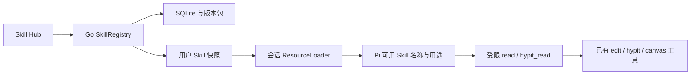

# 本地 Skill Hub 设计

输入框显式调用已接入：`canvas-assistant-skill-picker.tsx` 复用 Hub 页相同的作用域 Query key，打开菜单时重新读取，按启停和诊断过滤；按钮搜索和消息开头的 `/` 共用选择逻辑。选择只属于当前草稿，发送与重试通过 `selectedSkillId` 传递，不依赖提示词里拼接技能名称。Go 在入轮前校验可信快照；宿主完整加载入口、保存 `requestedSkill` 并记入实际读取记录。技能说明和根目录不由前端传递，轮次版本保持不变。浏览器专项使用真实助手组件与受控接口，后端专项使用真实工作区与技能快照；不调用付费模型。

状态：本地第一版已实施。本文记录设计边界与实现，提供本地 Skill 管理，不提供远程安装、搜索市场或联网更新。

## 1. 产品目标与术语

在现有左侧导航加入「Skill Hub」，用户在这里查看内置和本地安装的 Skill，导入文件，查看说明，启用、停用、重新导入更新和卸载。

继续使用当前一个 Agent Runtime 和已有项目会话。安装 Skill 不创建独立 Agent，不新增模型请求循环。

| 术语 | 用户可观察的含义 |
| --- | --- |
| 已安装 | Skill 文件已存入本地工作区，可以查看或管理 |
| 已启用 | 下一轮对话将它列为 Agent 可用的 Skill，由 Agent 按任务需要选择 |
| 已停用 | 下一轮不再展示或允许读取这份 Skill，文件仍保留 |
| 本轮已使用 | Agent 在某轮确实读取了 Skill 的说明，不等于仅仅启用了它 |
| 更新 | 重新导入同一 Skill 的新文件版本，保留稳定 Skill ID |
| 卸载 | 从本地管理清单移除用户安装的 Skill，删除归档；已物化的不可变 Runtime 副本保留，保障正在执行的回合 |

Skill 是说明和配套资源，不等于工具或可执行插件。停用 Skill 不卸载 Hypit 或 HyperFrames 引擎，也不删除已生成作品；工具的授权仍由现有运行端执行。

## 2. 第一版范围

包含：

- 左侧导航入口 `/skills`，与「剪辑编辑」「模型配置」「外部 Agent」使用相同导航风格。
- Skill 列表、搜索、启用状态筛选、详情及文件预览。
- 导入 `.md`、`.markdown` 或 `.zip`；ZIP 可以包含 `SKILL.md` 和 `references/`、`assets/`、`scripts/` 等配套目录。
- 每次导入一份 Skill；允许 ZIP 根目录或单个外层目录内包含入口。
- 启用、停用、本地重新导入更新、卸载用户安装 Skill。
- 按当前本地用户/工作区上下文隔离清单与设置，沿用现有本地身份，不新增登录体系。
- 下轮生效的 Runtime 更新和实际 Skill 使用记录。

第一版不含远程仓库、市场、评分收藏、自动更新、联网安装依赖、任意终端工具、目录链接安装或文件监听。导入目录可以先压缩成 ZIP；所有安装使用本地副本，外部源文件变化不会悄悄改动已安装版本。

## 3. 当前源码中可以复用的部分

| 当前部分 | 已有情况 | 本次设计的处理 |
| --- | --- | --- |
| `web/src/router.tsx` | `/skills` 路由目前跳回首页 | 将该路由接到新的本地 Hub 页面 |
| `web/src/pages/skills/` | 留有旧广场、导入、详情、编辑 UI | 复用导入/详情中的合适交互，重新组织成本地管理页面；不恢复广场、热门、收藏等流程 |
| `backend/internal/skills/` | 已有 Markdown/ZIP 安装、包校验、版本和文件读取 | 复用归属、版本、包文件与存储实现，提供 Hub 专用 Interface |
| `Skill`、`SkillVersion`、`SkillFile`、`UserSkillState` | 已有数据表 | 复用这些记录，不再额外建一份 JSON 作为清单真源 |
| `RegisterDesktopSkillRoutes` | 桌面路由已经不注册 GitHub 安装/同步 | 保持本地策略，Hub 请求不进入远程路径 |
| `web/src/services/skill-runtime.ts` | 旧前端提示词组合与 Skill 引用逻辑 | 不用它驱动 Pi 会话；新 Hub 统一交由 Go 与 `agent-host/` 接入 |
| `agent-host/full-control-loader.mjs` | 当前固定加载 BeefTV 剪辑 Skill 与 Hypit Skill，`reload()` 为空 | 改为消费当前会话的 Skill 快照，保留官方 SDK 解析与提示词机制 |
| `agent-host/skill-read-bridge.mjs` | 当前按启动时目录清单提供受限 `read` | 改为每轮按冻结快照校验读取，不能继续使用进程启动时的固定 allowlist |

旧 Skill 的全局 `Status` 与用户 `Added` 都不能直接当成新的 Runtime 启停状态。旧种子目录中的 Skill 也不因数据表里有记录就默认全部进入 Pi Runtime。

## 4. 页面设计

导航显示「Skill Hub」，使用与项目其余入口相同的图标尺寸、选中效果、收起行为和提示。页面复用 `WorkspacePage`、`PageHeader` 与产品 token，采用列表；详情使用居中的 `AppModal`，长内容在弹窗内滚动。

页面结构：

```text
Skill Hub                                      [导入 Skill]

[搜索名称、用途]                       全部  已启用  已停用

图标  BeefTV 剪辑 / 调整轨道…     内置技能    版本    [已启用] [⋯]
图标  Hypit / 根据参考制作场景…   内置技能    版本    [已启用] [⋯]
```

列表以分隔线组织技能，不使用卡片或封面。点击列表项内容区域打开居中详情弹窗；启停按钮与更多菜单独立响应。窄窗口隐藏版本列并调整来源位置。

每行展示名称、用途、来源「内置/本地技能」、版本、启停按钮和更多操作；文件总量放在详情。

更多操作：查看详情、重新导入（仅用户安装）、卸载（仅用户安装）。内置 Skill 可以启停、查看，不能删除、修改或被同名包覆盖。

详情弹窗包含用途与来源、版本、`SKILL.md` 说明、配套文件列表和问题说明。Markdown 安全渲染，不执行原始 HTML，也不加载远程链接或图片；代码按文本展示，二进制文件显示不可预览提示。文件中的原始技术说明保留，不将 Runtime 主机路径额外暴露给页面。

空态区分「还没有导入 Skill」和「没有符合筛选的 Skill」。列表读取失败提供重试；启停保存期间锁定列表写操作；保存失败保留原状态并显示错误，不假装已经生效。

## 5. 导入、更新与卸载流程

### 导入

1. 点击「导入 Skill」直接打开系统文件选择器，选择 Markdown 或 ZIP 文件；取消选择不会显示导入表单。
2. 后端只检查包并返回预览：名称、用途、文件数、版本（有声明时）、问题、是否有同名 Skill。此时不创建安装记录。
3. 选好文件后在列表上方显示页面内预览，不弹导入窗口。标准包只展示预览与安装按钮；只有缺少元数据时才展开填写字段。用户选择「安装后启用」（默认勾选）并点击「安装 Skill」。
4. 后端重新验证同一文件与预览内容哈希，存入现有不可变包版本并提交安装/启用状态。
5. 成功后收起导入预览，技能进入列表，提示「已保存，下一轮对话生效」。

ZIP 内缺少入口、包含多份 Skill、路径不安全或元数据不合法时，不创建半成品记录。支持有一个外层目录的常见 ZIP，不把完整电脑目录当作 Skill 包。

标准入口采用 `SKILL.md`，至少有 `name` 和 `description`。纯 Markdown 没有这两个字段时，导入预览要求用户补名称、用途，生成新的标准入口并展示结果；不静默猜测元数据。内部 `name` 与展示名称分开保存或映射，不能只改卡片名称就掩盖 Runtime 标识冲突。

同一份内容重复导入返回「已经安装」，不创建重复卡片。同名但不同内容提供「更新现有 Skill」选择；只允许更新用户自己的 Skill。内置保留标识不得覆盖。不能由扫描顺序决定哪份同名 Skill 获胜。

### 更新

通过列表菜单「从本地更新」直接选择新文件，复用页面内预览与校验。稳定 ID 和启停状态保留，增加版本记录，旧版本在已有回合期间保留。更新失败继续使用旧版本。

### 卸载

确认框显示 Skill 名称与下一轮失效说明。确认后立即移出下一轮可用清单，旧回合继续使用冻结版本；已生成作品不受影响。归档删除，Runtime 副本保留。第一版不实现自动缓存回收，以免误删活动轮次中的文件；缓存位于数据目录 `skill-runtime/`，历史缓存不再进入新轮次的读取范围。内置包、其他用户的包不能卸载。

停用属于可逆开关，直接保存即可，不弹确认框。

## 6. 状态与数据真源

继续使用本地 SQLite 和已有 `skill-packages/` 不可变归档。`SkillRegistry` Module 由现有技能域扩展实现，集中处理安装、目录、启停、快照和读取。它的 Interface 向页面提供管理结果，向 Runtime 提供不可变快照。

建议最小新增合同：

| 字段 | 含义 |
| --- | --- |
| `runtimeEnabled` | 当前用户是否允许把该 Skill 提供给 Agent；独立于全局 `Status` |
| `runtimeName` | 符合 SDK 规范且在当前用户有效集合中唯一的标识 |
| `runtimeRevision` | 当前用户有效 Skill 集合变化后的单调版本，用于会话刷新 |
| `originKind` | 实际来源：内置包或本地导入；导入文件不能自行声明「官方已验证」 |
| `diagnostics` | 包解析与运行兼容性诊断，由读取结果计算，不把所有问题合成一个启用位 |

`UserSkillState` 保留安装版本与现有成员关系，新增用户级 Runtime 启停字段。用户级集合版本采用单独小记录或可追踪版本合同，不能仅依赖数组排序与修改时间。旧数据迁移时不自动启用所有曾收藏或添加的 Skill；当前已经工作的两份 Runtime 内置 Skill明确保留默认启用，其余旧 Skill 可以展示但需用户选择启用。

内置源：

- BeefTV 剪辑 Skill 来自产品分发包。
- Hypit Skill 来自已安装且受控版本的 Hypit 分发。
- 其他旧种子 Skill 只有通过明确的 Runtime 兼容性检查后才进入 Hub 内置集合。

HyperFrames 原始官方 Skill 可由用户本地导入，但安装成功不代表所有 CLI 流程已接入。首版剪辑可用说明以已适配 `edit_*` 工具的 BeefTV 剪辑 Skill 为准。

## 7. Runtime 读取与生效机制



快照至少包含：可信用户范围、集合版本、已启用 Skill 的 ID/name/description/版本/内容哈希，以及安装根下的读取位置。用户范围来自 Go 当前工作区身份；不能信任浏览器或模型自报的用户 ID、目录和启用清单。

Go 将既有 ZIP 版本解包为受管理的不可变 Runtime 缓存。目录名使用内部 ID 与内容哈希，不使用用户上传名称拼主机路径。缓存由包文件重新生成，SQLite 与归档仍是真源。内置目录来自部署布局，不来自用户任意路径。

在 `session-owner.mjs` 预约新回合的同一会话锁内：

1. 获取当前用户最新快照；失败时不能默默使用一份未知/可能已停用的旧清单。
2. 与该会话已应用版本比较；改变时更新该会话的 ResourceLoader，并复用 Pi SDK 的 `session.reload()` 重建提示词与工具装配。
3. 保持同一个 SessionManager 与会话 ID，不丢失对话，也不新建模型循环。
4. 将快照固定到这轮记录后，再运行 `prompt()`；受限读取工具始终使用这份快照。

采用每会话 ResourceLoader，避免一个共享可变加载器在其他回合运行期间切换根目录或用户清单。多个会话可以读取同一不可变快照，但每个会话何时应用更新由自己的预约队列决定。

Hub 的写入只发布新集合版本，不中断运行中的回合，也不依赖频繁轮询或重启桌面应用。SDK 本身继续负责 Skill 元数据提示、全文读取后的上下文与会话生命周期。

## 8. 启停必须贯穿所有读取入口

当前系统提示中有「制作任务必须读 Hypit Skill」等固定流程。这部分必须改成根据已启用 Skill 选择方法，否则 Hub 关闭开关后 Agent 仍会被提示词强制使用它。工程归属、工具授权和版本保护等基础规则仍保留在系统策略里。

停用后的新回合：

- 可用 Skill 清单不再包含该 Skill。
- 通用 `read` 不能再读取它的目录。
- `hypit_read(area=skill)` 等专门入口使用同一快照检查，不能绕过开关。
- 如提供 `/skill:name` 或显式使用按钮，也要先检查快照。当前助手会在用户文本前附加工程上下文，不能直接假定 SDK 能识别前缀后的 slash 命令；第一版不以 slash 命令为必需功能。

已读过的 Skill 说明可能仍存在于历史上下文。停用可以停止新推荐和新读取，不能声称抹去了模型已经看过的内容。新回合用当前有效清单说明旧 Skill 已停用；用户需要完全清空上下文时使用已有「新对话」。工具调用仍由独立的业务授权校验，不能依赖 Skill 文本实现权限拒绝。

Hypit 制作源文件、已有场景和生成任务属于工程数据，不随 Skill 停用删除。停用说明和停止执行引擎是不同操作，本 Hub 只管理前者。

## 9. Skill 格式与工具兼容性

复用标准 `SKILL.md` 与 Pi SDK 的解析、诊断机制，不再定义新的 Skill 文档格式。Hub 可以使用产品元数据记录说明和适用范围，但不能把自然语言 `compatibility` 当作可验证的工具权限列表。

内置 Skill 可标注已适配能力。本地导入 Skill 标注「本地导入」，必要时提示「需要终端能力，当前未接入」或「包含脚本，当前只读取说明」。只对明确已知的能力缺失给出诊断，不凭文本出现 `npx` 就断言整个 Skill 不可用。

Skill 包中的脚本按文件保存和展示，不在导入、启用或读取时自动执行。新增终端、插件或外部能力以后，再按具体工具合同处理；不能通过 Skill 安装自动获得账户、任意主机文件或网络工具权限。

读取按包版本限制在其安装目录内，沿用真实路径校验并覆盖压缩包穿越、符号链接/联接和文件类型/大小约束。读取图片等二进制资源时走明确的资源合同，不把所有文件都当作 UTF-8 文本返回。

## 10. Hub Interface 与文件分工

建议本地 Hub 使用单独且精简的 HTTP Interface，例如：

| 请求 | 行为 |
| --- | --- |
| `GET /api/skill-hub` | 当前用户清单、启停与诊断 |
| `GET /api/skill-hub/:id/files`、`GET /api/skill-hub/:id/file?path=…` | 文件索引与正文，复用已有 Skill 文件合同 |
| `POST /api/skill-hub/inspect` | 本地上传预览与校验，不写安装记录 |
| `POST /api/skill-hub/install` | 导入或显式更新，携带预览哈希、是否启用与目标 ID（更新时） |
| `PATCH /api/skill-hub/:id/enabled` | 用户启停；集合版本在下一轮可信快照中读取 |
| `DELETE /api/skill-hub/:id` | 卸载用户安装 Skill，内置拒绝 |

这些请求背后复用 `internal/skills`，不是另外建管理库。普通页面只能提交文件和业务 ID，不提交主机路径。页面查询与写入使用现有 `http` 信封和带用户 scope 的 React Query。

| 位置 | 拟承担的改动 |
| --- | --- |
| `web/src/pages/skills/` | 本地 Hub 列表、导入、详情 |
| `web/src/services/api/skill-hub.ts` | 本地管理调用及类型 |
| 导航、router、路由预加载 | 恢复 `/skills`，显示 Skill Hub |
| `backend/internal/skills/`、repository/model | 扩展现有注册、用户启停、快照和版本处理 |
| `handler`、`localapp`、bootstrap | 当前本地身份、管理请求、Runtime 快照的可信传递 |
| `agent-host/full-control-loader.mjs` | 按会话快照返回 Skills、实现 reload |
| `agent-host/session-owner.mjs` | 回合间刷新，保持 SDK 与 transcript |
| `agent-host/skill-read-bridge.mjs`、Hypit Skill 读取入口 | 按本轮有效快照读取 |
| `scripts/package-agent-host.mjs` | 已包含受限读取模块和产品 Skill 目录；本次未执行完整发行打包 |

## 11. 可观察性与最小验收

Hub 展示「已启用」而非「正在运行」。助手的回合记录可以保存实际读取的 Skill ID、name、版本、内容哈希，复用 SessionManager 的记录，不另建一套聊天数据库。需要时在该回合详情显示「使用了哪些 Skill」；不记录完整参考内容或私有主机路径。

实施后的最小验收集中在用户可操作的流程：

- 从导航打开 Hub，列表沿用产品配色，明暗主题和窄窗口可操作；导入先打开文件选择器，选好后显示页面内预览。
- 两份当前内置 Skill 可查看、启停；其他旧种子条目不会全部误启用。
- 导入单 Markdown 与带参考文件 ZIP，重开应用后记录和启停状态仍在。
- 停用后下一轮不再展示/读取，通用读取和专用 Hypit 读取的规则一致。
- 安装、更新、停用、卸载发生在回复过程中时，旧回合版本稳定；下一轮应用新清单。
- 一个用户的 Skill 不会进入另一个本地身份的清单或读取路径。
- 卸载不删除作品；同名内置覆盖、无效包和异常路径不产生半成品安装。
- 正式包包含 Skill 文档与读取模块，不能只在开发目录生效。

本次自动验证限制为前端构建、后端编译、两个 Skill 域场景、本地迁移幂等检查和一个零模型 SDK 场景，随后更新桌面预览供手动验收。未调用付费模型，也未运行完整测试套件或完整发行打包。
